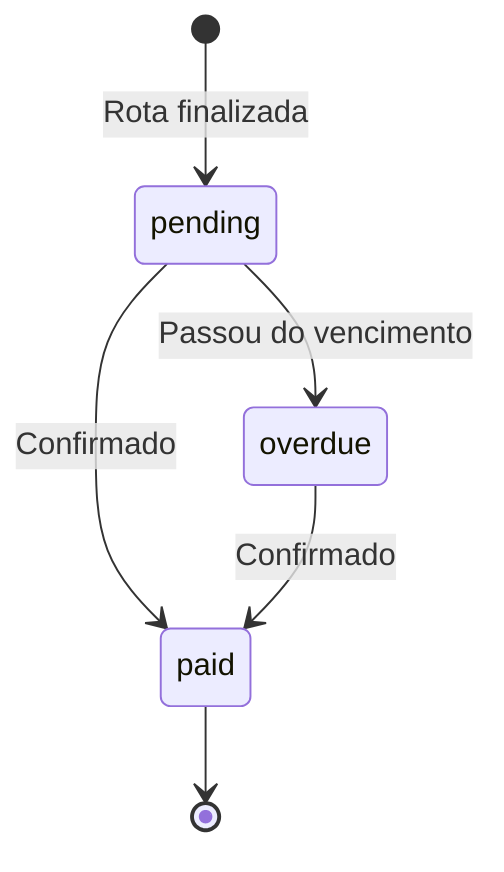

# Sistema de Gerenciamento de Salários

## 📋 Visão Geral

Sistema automatizado para controlar pagamentos de salários aos motoristas, vinculados às rotas finalizadas e com vencimento toda quinta-feira.

## 🎯 Funcionalidades

### 1. Registro Automático
- **Quando**: Ao finalizar uma rota (`/rotas` → Finalizar Rota)
- **O que acontece**: 
  - Sistema calcula a próxima quinta-feira
  - Cria registro de `SalaryPayment` automaticamente
  - Status inicial: `pending`
  - Valor: salário definido na rota (`driver_salary`)

### 2. Notificações Semanais (Quinta-feira 12:00)
- **Recorrência**: Toda quinta-feira às 12:00
- **Destinatário**: Managers e Admins
- **Conteúdo**:
  - Lista de salários com vencimento no dia
  - Valor total a pagar
  - Botões de confirmação individual ou em lote
- **Mensagem de exemplo**:
  ```
  🔔 LEMBRETE: QUINTA-FEIRA - DIA DE PAGAMENTO!
  
  📅 Vencimento: 24/10/2024
  💰 Total a pagar: R$ 450,00
  
  👥 Salários do dia:
  
  👤 João Silva
    • Rota #42 - R$ 200,00
    • Rota #43 - R$ 150,00
    💵 Subtotal: R$ 350,00
  
  👤 Maria Santos
    • Rota #44 - R$ 100,00
    💵 Subtotal: R$ 100,00
  
  👇 Confirme os pagamentos:
  [✅ Confirmar R$ 200,00 (João Silva)]
  [✅ Confirmar R$ 150,00 (João Silva)]
  [✅ Confirmar R$ 100,00 (Maria Santos)]
  [✅ CONFIRMAR TODOS (R$ 450,00)]
  ```

### 3. Notificações Diárias de Atraso (09:00)
- **Recorrência**: Todo dia às 09:00
- **Condição**: Se existem salários com `due_date < hoje`
- **Ações automáticas**:
  1. Atualiza status de `pending` → `overdue`
  2. Envia mensagem de alerta aos managers
- **Mensagem de exemplo**:
  ```
  ⚠️ ATENÇÃO: SALÁRIOS ATRASADOS!
  
  🔴 Total em atraso: R$ 450,00
  📊 Quantidade: 3 pagamento(s)
  
  👥 Detalhamento:
  
  👤 João Silva
    • Rota #42 - R$ 200,00
       ⏰ Vencimento: 17/10/2024 (7 dias de atraso)
  
  ⚡ Regularize os pagamentos o quanto antes!
  ```

### 4. Comando Manual: `/salarios_pendentes`
- **Permissão**: Apenas managers e admins
- **Função**: Lista todos os salários pendentes ou atrasados
- **Recursos**:
  - Agrupamento por motorista
  - Indicador de dias de atraso
  - Botões de confirmação individual
  - Botão de confirmação em lote

### 5. Confirmação de Pagamento
- **Como**: Clicar nos botões das notificações ou do comando
- **Efeito**:
  - Atualiza `status` → `paid`
  - Registra `paid_date` (data/hora atual)
  - Registra `confirmed_by` (ID do manager)
- **Feedback**:
  ```
  ✅ Pagamento Confirmado!
  
  👤 Motorista: João Silva
  📋 Rota #42
  💰 Valor: R$ 200,00
  📅 Vencimento: 24/10/2024
  ✅ Pago em: 24/10/2024 14:30
  ```

## 🗄️ Estrutura de Dados

### Tabela: `salary_payment`

| Campo | Tipo | Descrição |
|-------|------|-----------|
| `id` | INTEGER | Chave primária |
| `driver_id` | INTEGER | FK → User (motorista) |
| `route_id` | INTEGER | FK → Route (rota vinculada) |
| `amount` | FLOAT | Valor do salário |
| `week_start` | DATE | Início do período trabalhado |
| `week_end` | DATE | Fim do período trabalhado |
| `due_date` | DATE | Vencimento (quinta-feira) |
| `paid_date` | DATETIME | Quando foi pago (NULL = não pago) |
| `status` | VARCHAR(20) | `pending` / `overdue` / `paid` |
| `notes` | TEXT | Observações (ex: "Salário ref. rota Centro") |
| `created_by` | BIGINT | FK → telegram_user_id (quem criou) |
| `confirmed_by` | BIGINT | FK → telegram_user_id (quem confirmou) |
| `created_at` | DATETIME | Data de criação |
| `updated_at` | DATETIME | Última atualização |

### Estados (Status)



## 🔧 Configuração

### 1. Variáveis de Ambiente
```env
BOT_TOKEN=seu_token_aqui  # Obrigatório para notificações
```

### 2. Timezone
O scheduler usa `America/Sao_Paulo` (horário de Brasília)

### 3. Horários das Jobs
- **Quinta-feira**: 12:00 (meio-dia)
- **Diária**: 09:00 (manhã)

## 📊 Fluxo Completo

### Exemplo de Cenário

1. **Segunda-feira 10:00** - Manager finaliza rota do motorista João
   - Sistema cria `SalaryPayment`:
     - `driver`: João Silva
     - `route`: #42
     - `amount`: R$ 200,00
     - `due_date`: Quinta-feira (24/10)
     - `status`: `pending`

2. **Quinta-feira 12:00** - Notificação automática
   - Manager recebe mensagem com botões
   - João ainda não foi pago → continua `pending`

3. **Sexta-feira 09:00** - Passou do vencimento
   - Sistema atualiza: `status` → `overdue`
   - Manager recebe alerta de atraso
   - Notificações diárias continuam até pagamento

4. **Sábado 14:00** - Manager confirma pagamento
   - Clica no botão "✅ Confirmar"
   - Sistema atualiza:
     - `status` → `paid`
     - `paid_date`: 26/10/2024 14:00
     - `confirmed_by`: ID do manager
   - Notificações param para este pagamento

## 🛠️ Comandos

### Para Managers/Admins

| Comando | Descrição |
|---------|-----------|
| `/salarios_pendentes` | Lista salários pendentes e atrasados com botões de confirmação |

### Callbacks (botões)

| Pattern | Ação |
|---------|------|
| `confirm_salary:{id}` | Confirma pagamento individual |
| `confirm_salary_all:{ids}` | Confirma múltiplos pagamentos |

## 📝 Auditoria

O sistema mantém registro completo de:
- **Quem criou** o registro (`created_by`)
- **Quando foi criado** (`created_at`)
- **Quem confirmou** o pagamento (`confirmed_by`)
- **Quando foi pago** (`paid_date`)
- **Última atualização** (`updated_at`)

## 🔒 Permissões

- **Criar registro**: Automático (sistema ao finalizar rota)
- **Ver salários pendentes**: Managers e Admins
- **Confirmar pagamentos**: Managers e Admins
- **Receber notificações**: Managers e Admins

## 🚀 Próximos Passos (Futuro)

- [ ] Relatório mensal de salários pagos
- [ ] Exportação para Excel
- [ ] Histórico de pagamentos por motorista
- [ ] Dashboard com estatísticas de pagamentos
- [ ] Integração com sistema de folha de pagamento
